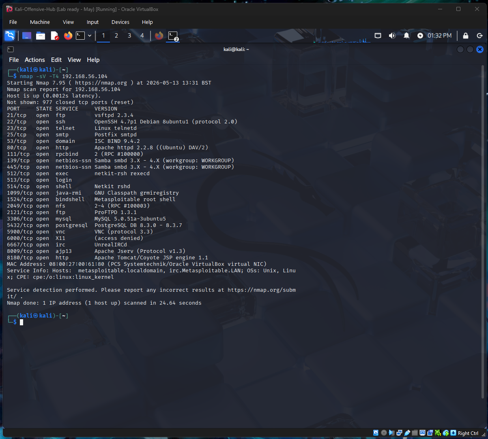
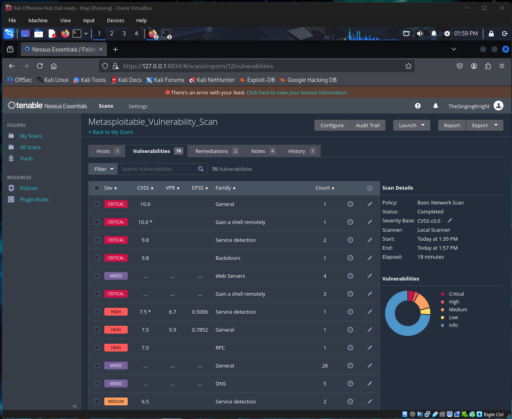
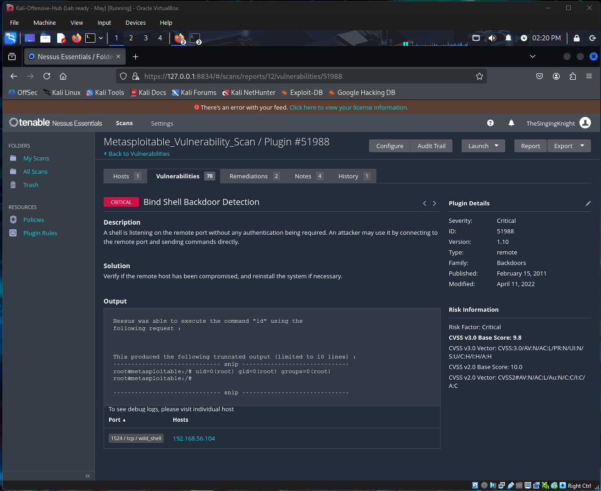
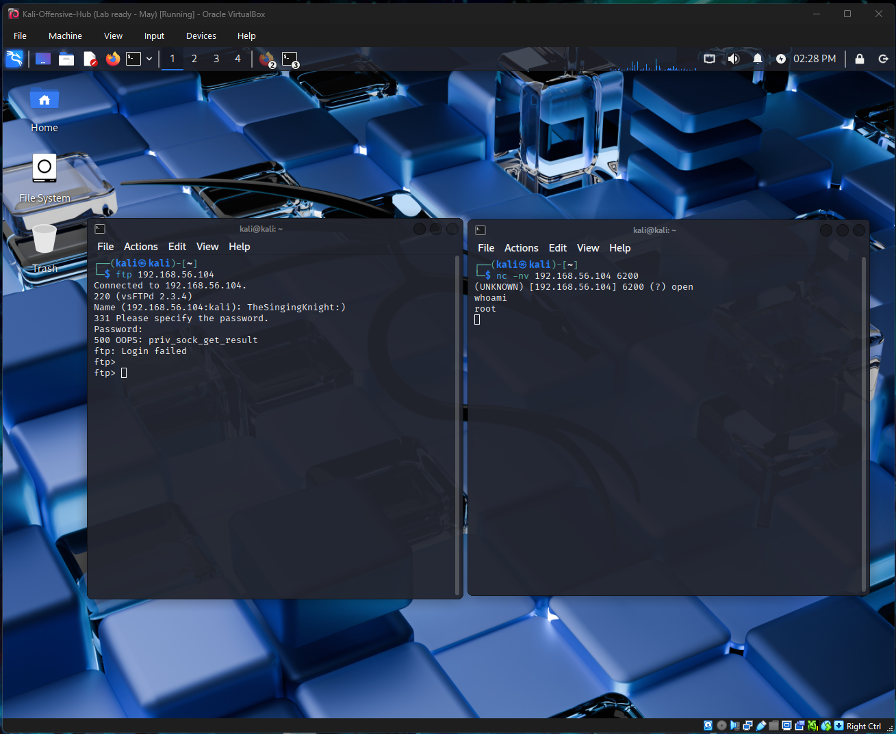

# Project 2: Vulnerability Management & Risk Assessment

## Project Origins
Following the successful implementation of my SIEM and endpoint monitoring in Phase 1 (see [Project 1: Windows Endpoint Monitoring & SIEM Ingestion](../Project_1_Endpoint_Monitoring/README.md)), I moved to the next logical step in the security lifecycle: **Vulnerability Management**.  

In this phase, I transitioned from the role of an Engineer to that of a Risk Analyst. My mission was to identify the "open windows" within my lab environment and provide a professional, prioritised roadmap for securing them. This project serves as the bridge between my defensive configurations and the offensive simulations I will perform in Phase 3.

---

## 1. The Mission Objective
The goal of this project was to perform a credentialed vulnerability scan against both my Windows 10 host and a legacy Metasploitable 2 target. I aimed to identify security gaps and, more importantly, apply the **CVSS (Common Vulnerability Scoring System)** framework to prioritise remediation based on actual business risk rather than just a list of technical bugs.

> **Analyst’s Note:** During the "First Light" discovery phase, I encountered a slight challenge with Nessus service persistence on Kali. Identifying that the service was 'inactive (dead)' and manually reviving it via the terminal was a great reminder that even automated tools require sound system administration knowledge.

---

## 2. Technical Foundations: The "Surgical" Toolset
* **Nessus Essentials:** I selected Nessus as my primary scanning engine due to its industry-wide reputation for accuracy and its detailed vulnerability database.
* **Nmap:** Before launching a heavy Nessus scan, I utilised Nmap for initial service fingerprinting. I prioritised this to reduce network "noise" and understand the attack surface before engaging in more intrusive scanning.
* **CVSS v3.1 Framework:** I utilised this scoring system to move away from subjective labels like "High" or "Critical" and instead focus on objective metrics like attack complexity and impact.

---

## 3. Lab Environment: The Target Surface
The scan targeted two distinct ends of the security spectrum across the segmented lab environment:

| Asset Name (VirtualBox) | Hostname | IP Address | Role |
| :--- | :--- | :--- | :--- |
| **Kali-Offensive-Hub** | `kali` | `192.168.56.102` | SIEM & Offensive Hub (Nessus Scanner / Validation) |
| **Win10-Defensive-Hub** | `Win10-Defensive` | `192.168.56.106` | Modern Endpoint Target |
| **Metasploitable2-Legacy-Target** | `metasploitable` | `192.168.56.104` | Legacy Linux Target |

---

## 4. Technical Evidence (The Showcase)

### [Screenshot 1 - The Discovery Map]
A capture of the Nmap service scan for the Metasploitable target, demonstrating initial reconnaissance and service fingerprinting.

### [Screenshot 2 - The Vulnerability Dashboard]
A high-level view of the Nessus results, authenticated as TheSingingKnight, showing the risk distribution across the laboratory environment.

### [Screenshot 3 - The "Root" Finding]
A deep-dive into a Critical vulnerability (Bind Shell Backdoor Detection), specifically showing the Plugin Output with `uid=0(root)` and the associated CVSS 9.8 metrics.

### [Screenshot 4 - Target Validation Evidence]
A terminal capture proving manual validation of the exploit. This shows the "Secret Knock" using the `TheSingingKnight:)` trigger and the resulting root shell access.

---

## 5. Strategic Analysis: From "Bugs" to "Business Risk"
In a consultancy role, simply handing a client a 100-page list of vulnerabilities is counter-productive. By analysing the results through the lens of CVSS, I was able to determine that while some "Medium" risks were numerous, a single "Critical" vulnerability in a service like SMB or VNC represented the true path of least resistance for an attacker.

For instance, identifying the “Bind Shell Backdoor Detection” isn't just a technical find; it represents an immediate path to full system compromise. By manually validating this 'secret knock' as `TheSingingKnight`, I proved that the risk identified by the scanner was 100% exploitable in the current environment. 

---

## 6. Defensive Maturity & Hardening Roadmap
To move this environment toward a more mature security posture, I identified the following next steps:

* **Decommissioning Legacy Protocols:** I recommend disabling SMBv1 and Telnet immediately via registry and service-level changes.
* **Patch Management Lifecycle:** Establishing a "Critical-First" patching cycle based on the CVSS scores identified in this report.
* **Credentialed Scanning:** My next step for the Windows 10 target is to move toward fully credentialed scans to identify "inside-the-box" vulnerabilities that a network-only scan might miss.

---

## Key Skills Demonstrated
* Vulnerability Management (Nessus)
* Network Reconnaissance (Nmap)
* Risk Assessment (CVSS Framework)
* Surgical Troubleshooting

