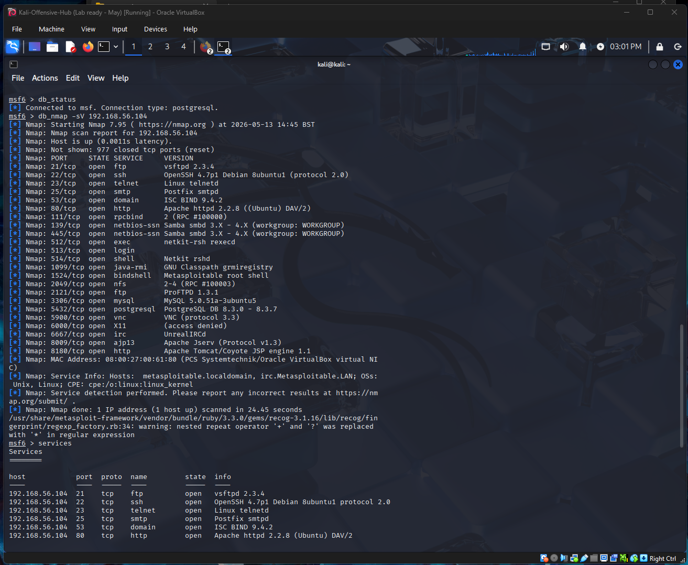
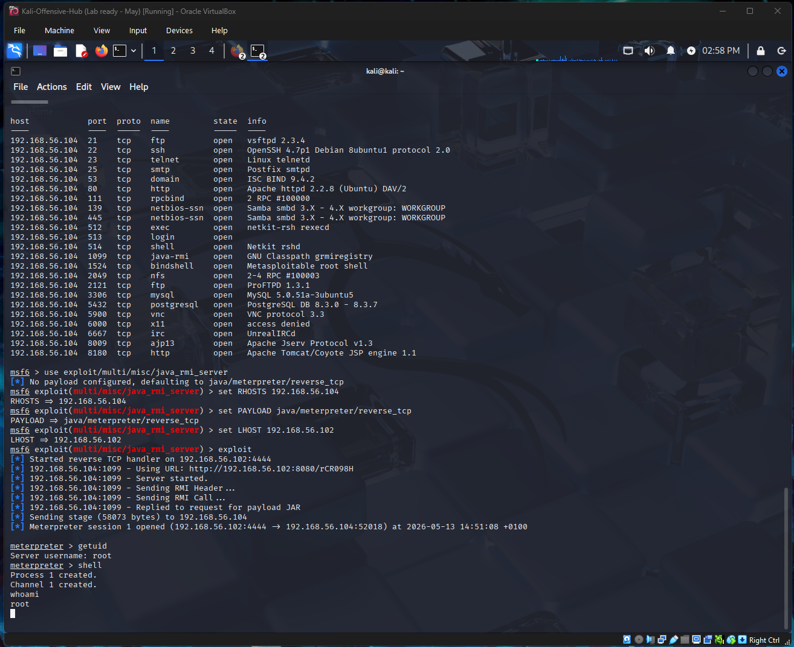
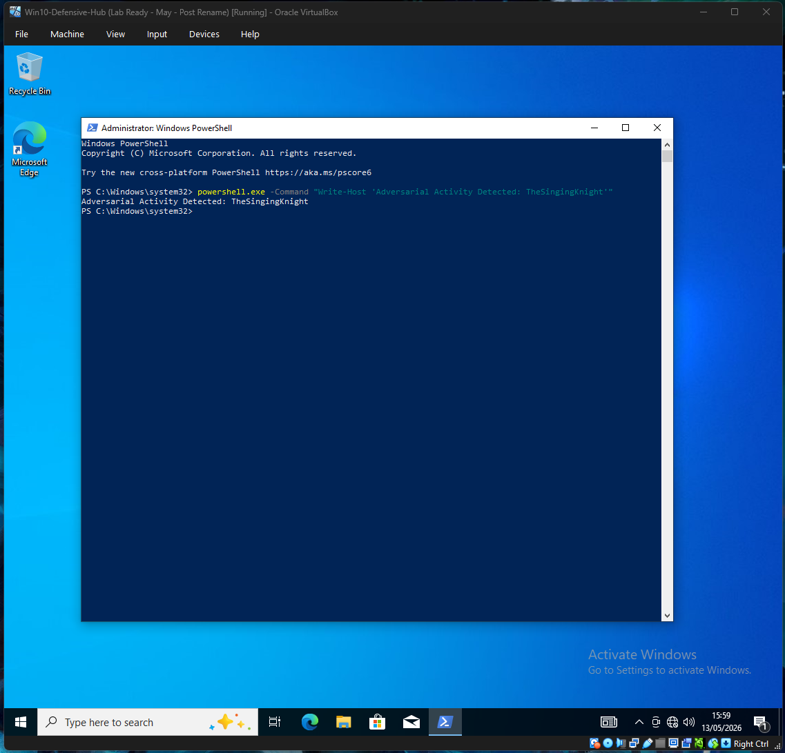
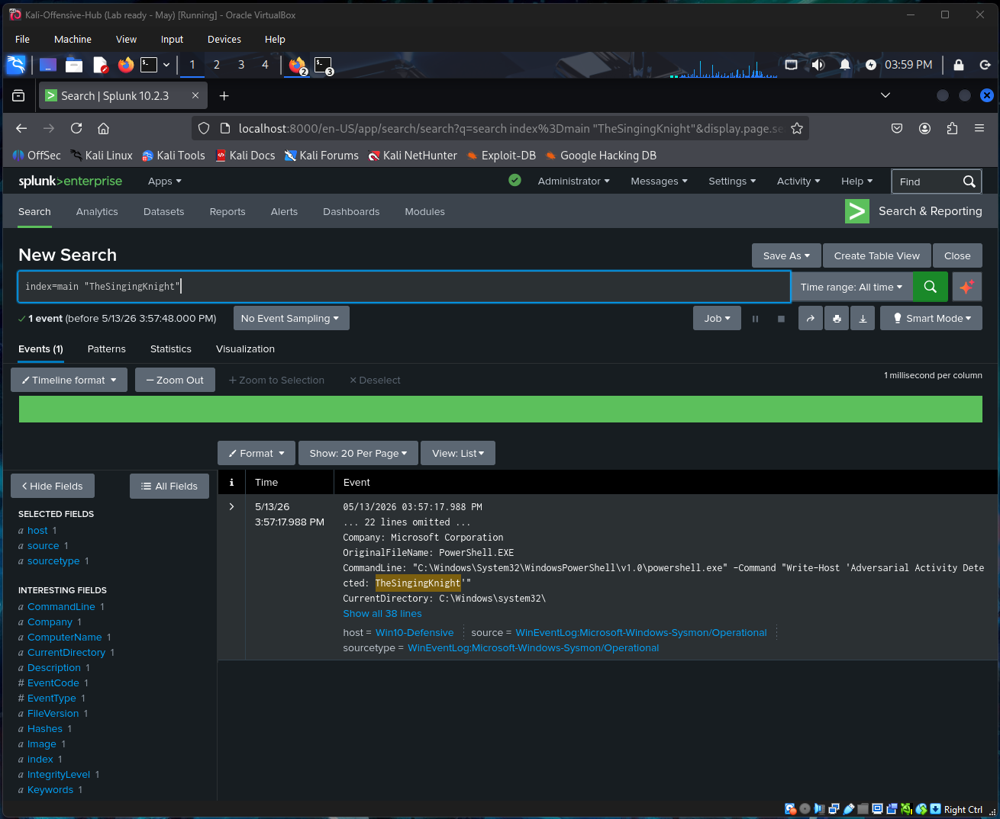

# Project 3: The Adversarial Lifecycle: From Reconnaissance to Detection

## Project Origins
This final report completes the "One Mission, Three Reports" narrative within a unified Cyber Range. Having established **Visibility** (Phase 1) and identified **Vulnerabilities** (Phase 2), I transitioned into the role of a Penetration Tester. My goal was to simulate a real-world attack to validate whether my defensive configurations could actually detect a determined adversary. This project serves as the ultimate "Closing the Loop" stress test for the entire lab ecosystem.

---

## 1. The Mission Objective
The objective was to move through the tactical stages of an attack: performing deep reconnaissance, exploiting a critical vulnerability identified in the previous Nessus assessment, and establishing a remote shell. Crucially, I aimed to verify that the **Sysmon** and **Splunk** configurations from Project 1 successfully flagged the malicious activity on a hardened host.

> **Analyst’s Note:** While seeing a "Meterpreter" shell open is a significant milestone, the true technical victory was the **Detection Validation**. Switching to the Splunk dashboard and seeing the specific adversarial string in the logs proved the structural integrity of the entire defensive pipeline.

---

## 2. Phase 1: Tactical Reconnaissance (Metasploit Integrated)
I began by moving beyond basic terminal sweeps to utilize the Metasploit Framework's integrated database for data persistence.
* **The Command:** `db_nmap -sV 192.168.56.104`
* **The Logic:** I utilized `-sV` to determine version intensity. By running this within Metasploit, I mapped the attack surface directly into the offensive workspace. This reconnaissance confirmed the existence of high-risk services, specifically **Java RMI (Port 1099)**, as identified in my earlier vulnerability assessment.

---

## 3. Phase 2: Exploitation & Identity (Meterpreter)
Using the reconnaissance data, I targeted the Java RMI Server vulnerability on the legacy host.
* **The Choice:** I selected the `exploit/multi/misc/java_rmi_server` module. This represented a "Surgical" entry point that required a multi-stage payload to achieve full system oversight.
* **The Execution:** I utilized a `java/meterpreter/reverse_tcp` payload. This granted a sophisticated command-line shell that remains in the target’s memory (RAM) to avoid disk-based detection. I verified my identity within the target system as **root** to confirm a total system compromise.

---

## 4. Technical Evidence (The Showcase)

### [Screenshot 1 - Adversarial Reconnaissance]
A view of the Metasploit services table, proving the ability to manage reconnaissance data within an industry-standard framework.

### [Screenshot 2 - Full Chain Exploitation]
A consolidated capture showing the exploit launch, the successful Meterpreter session opening, and the `whoami` result confirming root access as TheSingingKnight.

### [Screenshot 3 - Adversarial Process Trigger]
A capture of the Windows 10 "Defensive Hub" PowerShell window, showing the manual execution of a "Living off the Land" command string to simulate post-exploitation activity.

### [Screenshot 4 - SIEM Detection Verification]
The definitive "Technical Receipt" from Splunk, showing EventCode: 1 (Process Creation) successfully capturing the exact adversarial command string, validating the visibility engineered in Project 1.

---

## 5. Strategic Analysis: The Defensive/Offensive Loop
An exploit is only half the story. The true value of this project was the **Detection Validation**. While host-based firewalls filtered initial network reconnaissance probes, the host-based sensors (Sysmon) successfully flagged the adversarial process execution.

> **Analyst’s NB: The Troubleshooting Pivot**
> During the final validation phase, an initial attempt to trigger a Sysmon network connection log (Event ID 3) via an Nmap scan failed to register in Splunk. I identified that the Windows firewall was filtering the packets before a TCP connection could be established, meaning Sysmon had no established connection to log. Rather than artificially lowering the firewall to force a network rule to work, I pivoted to a host-based "Living off the Land" simulation. By executing a simulated adversarial string in PowerShell, I successfully triggered a Process Creation log (Event ID 1). This proved that while the perimeter successfully defended the network, the host-based sensors were perfectly tuned to catch internal execution.

This demonstrates a critical professional insight: even if a "Critical" vulnerability exists that cannot be immediately patched, having the right **Visibility** (Project 1) ensures the attack is detected in real-time. This "interconnected" approach—where offensive testing informs defensive tuning—is what defines a mature security posture.

---

## 6. Defensive Maturity & Hardening Roadmap
To break the adversarial lifecycle, the following hardening steps are recommended based on this simulation:

* **Service Minimisation:** Disabling all non-essential services discovered during the Metasploit recon to reduce the attack surface.
* **Sensor Tuning:** Ongoing "tuning" of the Sysmon configuration to explicitly monitor **Event ID 3 (Network Connections)** on critical ingestion ports (8000, 9997) to catch lateral movement attempts.
* **Behavioral Alerting:** Moving from basic keyword searches to behavioral alerting in Splunk—such as flagging any PowerShell execution containing "encoded" or "hidden" flags.

---

## Key Skills Demonstrated
* Ethical Hacking (Metasploit)
* Network Reconnaissance (Nmap)
* SIEM Detection & Analysis (Splunk)
* "Living off the Land" Simulation
* Surgical Troubleshooting

